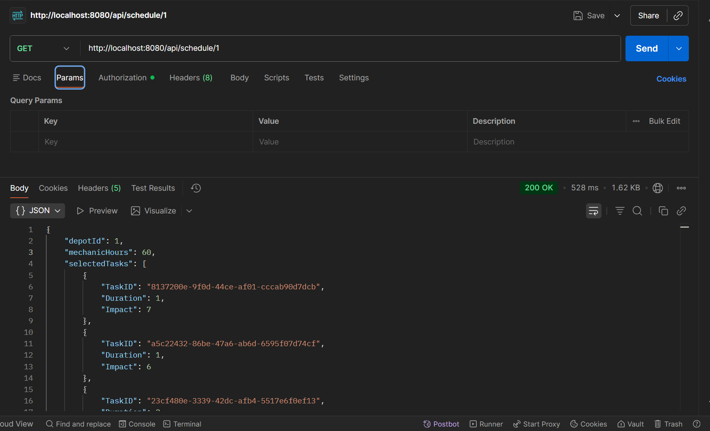

# Vehicle Maintenance Scheduler

## Endpoint

`GET /api/schedule/{depotId}`

## Example

### Endpoint: `GET /api/schedule/1`
### Response Time: `527.92 ms`
### Response Screenshot:

### Response:
```json
{
"depotId": 1,
"mechanicHours": 60,
"selectedTasks": [
{
"TaskID": "8137200e-9f0d-44ce-af01-cccab90d7dcb",
"Duration": 1,
"Impact": 7
},
{
"TaskID": "a5c22432-86be-47a6-ab6d-6595f07d74cf",
"Duration": 1,
"Impact": 6
},
{
"TaskID": "23cf480e-3339-42dc-afb4-5517e6f0ef13",
"Duration": 2,
"Impact": 10
},
{
"TaskID": "c5ca8aad-61a6-4d37-8d07-c46fd9480747",
"Duration": 2,
"Impact": 10
},
{
"TaskID": "ca4e9261-918f-4396-b34f-651dcdfdf09b",
"Duration": 2,
"Impact": 9
},
{
"TaskID": "ac258a3d-03ae-48d6-9b71-8956d62310aa",
"Duration": 3,
"Impact": 9
},
{
"TaskID": "ce2a4fcc-e1e5-4875-b81c-641c7402d76b",
"Duration": 1,
"Impact": 3
},
{
"TaskID": "77692f6f-d8bd-4f10-a68e-e93c5fc92fc8",
"Duration": 1,
"Impact": 3
},
{
"TaskID": "505a763d-cbf0-45f9-b542-4f12e7bb0b0d",
"Duration": 2,
"Impact": 5
},
{
"TaskID": "43e109bf-ce3a-4129-9867-2d7fb483a555",
"Duration": 1,
"Impact": 2
},
{
"TaskID": "e4431e64-6e58-4567-be8f-3db7df4733d1",
"Duration": 2,
"Impact": 4
},
{
"TaskID": "15c1d65b-3530-4f3a-b8d5-b1e87eda4bee",
"Duration": 6,
"Impact": 10
},
{
"TaskID": "591321bd-b05a-4dbc-83b0-2c8759055b0d",
"Duration": 7,
"Impact": 10
},
{
"TaskID": "2c99e25b-1f36-4d9b-bcae-64f5da80d17e",
"Duration": 7,
"Impact": 10
},
{
"TaskID": "75c7b47e-2f10-4f33-9273-2f93e68c428a",
"Duration": 5,
"Impact": 7
},
{
"TaskID": "8ba69618-dba5-4728-9922-d224c591dbab",
"Duration": 3,
"Impact": 4
},
{
"TaskID": "ae108b53-4273-449c-b58b-73c1c241bd7a",
"Duration": 6,
"Impact": 7
},
{
"TaskID": "8dc03d89-5916-47af-8e97-36907ee5451b",
"Duration": 7,
"Impact": 7
},
{
"TaskID": "e28eb250-5cac-4c8d-91ec-a3c23125fdd9",
"Duration": 1,
"Impact": 1
}
],
"totalImpact": 124,
"totalDuration": 60
}
```